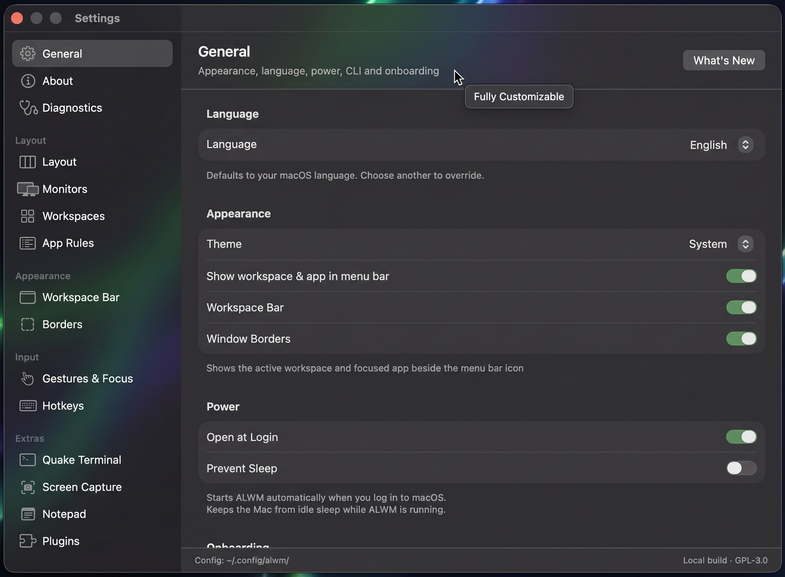
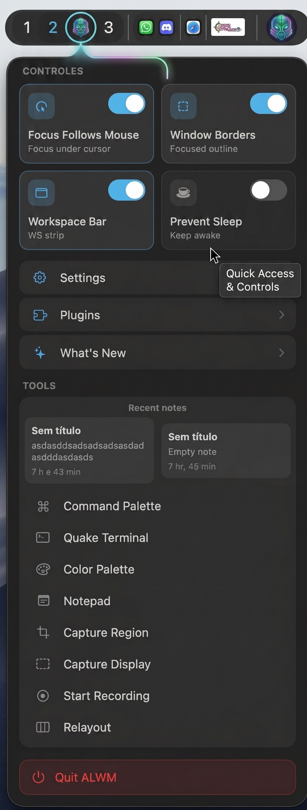
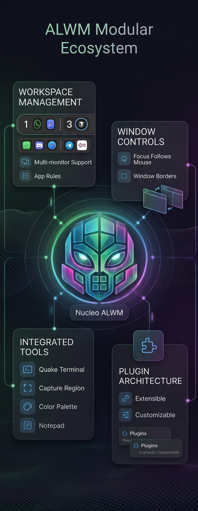

<p align="center">
  
</p>

<h1 align="center">ALWM</h1>

<p align="center">
  <strong>Tiling window manager for macOS</strong><br />
  Niri-style scrolling columns or Dwindle BSP — pick per workspace.
</p>

<p align="center">
  <a href="https://github.com/sponsors/lokize"></a>
  <a href="LICENSE"></a>
  
  
</p>

<p align="center">
  Built from scratch, inspired by <a href="https://github.com/YaLTeR/niri">Niri</a>. Licensed under <strong>GPL-3.0</strong>.
</p>

---

## Screenshots

<p align="center">
  
</p>
<p align="center"><em>Settings — general, layout, workspace bar, plugins, and more.</em></p>

<p align="center">
  
</p>
<p align="center"><em>Status menu — quick toggles, recent notes, and tools.</em></p>

<p align="center">
  
</p>
<p align="center"><em>Modular ecosystem — workspaces, window controls, tools, and plugins.</em></p>

---

## What you get

- **Layouts** — Niri or Dwindle per workspace, optional monitor pins
- **Workspace bar** — chips, app icons, focused title, plugin slots on every display
- **Focus border** & overview with column thumbnails
- **Quake terminal** — Ghostty when installed, otherwise Terminal.app
- **Tools** — fuzzy command palette, notepad, screen capture, color picker, float toggle
- **Gestures & hotkeys** — trackpad gestures, fully editable bindings
- **Settings UI** — 10 languages (follows macOS by default)
- **Live config** — TOML under `~/.config/alwm/`
- **IPC** — `alwmctl`
- **Plugins** — clock, Steam price watcher, and [your own](docs/plugins.md)
- **Open at login** — starts with macOS (toggle in Settings → General)

---

## Requirements

- macOS 15+
- Swift 6 / Xcode 16+
- Accessibility (Input Monitoring for hotkeys; Screen Recording only for Overview thumbnails)

---

## Download (macOS)

Pre-built **DMG** for each release on [GitHub Releases](https://github.com/lokize/ALWM---Tiling-window-manager-for-macOS/releases):

1. Download `ALWM-x.y.z.dmg`
2. Open it and drag **ALWM** into **Applications**
3. First launch: right-click the app → **Open** (CI builds are ad-hoc signed)
4. Grant **Accessibility** and **Input Monitoring**

Pushes to `main` trigger an automatic release build (version from `VERSION` in the repo). **Each push with code changes must bump `VERSION`** — otherwise CI refreshes the existing release tag instead of creating a new one.

Sync to GitHub (auto bump if missing):

```bash
bash scripts/install-git-hooks.sh   # once: pre-commit + pre-push
bash scripts/sync-push.sh           # bump + push main
```

To publish manually from your machine (after `gh auth login`):

```bash
bash scripts/publish-github-release.sh
```

Building locally with `package.sh` + `create-dmg.sh` only creates `dist/ALWM-{VERSION}.dmg` — it does **not** upload to GitHub.

---

## Build

```bash
./scripts/package.sh
```

Installs to `~/Applications/ALWM.app` and `~/.local/bin/alwmctl`, then relaunches.

```bash
ALWM_CONFIG=release ./scripts/package.sh          # optimized
ALWM_CONFIG=release ALWM_FAST_RELEASE=1 ./scripts/package.sh
ALWM_RELAUNCH=0 ./scripts/package.sh              # package only
```

Signing uses a stable local cert (`ALWM Local Signing` in `~/.config/alwm/signing/`) so TCC grants survive rebuilds. Ad-hoc signing (`codesign -s -`) changes the CDHash every time and macOS treats it as a new app — avoid it.

Optional: `export ALWM_SIGN_IDENTITY="Apple Development: Your Name"`.

---

## First run

1. Open `~/Applications/ALWM.app`
2. Grant **Accessibility** and **Input Monitoring**
3. Tiling starts on managed windows
4. ALWM registers as a **Login Item** by default (Settings → General to change)

```bash
alwmctl focus left
alwmctl quake
alwmctl palette
alwmctl float toggle
alwmctl switch-workspace 2
alwmctl status
```

---

## Hotkeys (defaults)

| Chord | Action |
|---|---|
| ⌥ H/L/K/J | Focus |
| ⌥⇧ ←/→/↑/↓ | Move window |
| ⌥ U/I | Scroll strip (Niri) |
| ⌥ 1–4 | Switch workspace |
| ⌥⇧ 1–4 | Send window to workspace |
| ⌥ ←/→/↑/↓ | Resize |
| ⌥ O | Overview |
| ⌥ T | Quake |
| ⌥ P | Palette |
| ⌥ F | Float |
| ⌥ , | Settings |

Everything is editable in Settings or `~/.config/alwm/hotkeys.toml`.

---

## Config

```
~/.config/alwm/
├── settings.toml
├── gestures.toml
├── hotkeys.toml
├── workspaces.toml
├── plugins.toml
└── apprules.d/
```

```toml
[[workspaces]]
id = "1"
name = "Code"
layout = "niri"
monitorIndex = 0

[[workspaces]]
id = "2"
name = "Chat"
layout = "dwindle"
monitorIndex = 1
```

Quake prefers Ghostty (`com.mitchellh.ghostty`); override with `quakeBundleID`. To leave Ghostty’s own quick terminal alone, see `ghostty-quick-terminal.toml.sample`.

---

## Plugins

Bundled plugins live under `plugins/` (same **GPL-3.0** as the app) and show up in **Settings → Plugins**. Enable, pick bar placement, and optionally lock a chip to one monitor.

Docs for authors (API, packaging, PR): **[docs/plugins.md](docs/plugins.md)**.

---

## Versioning

`MAJOR.MINOR.PATCH`. Patch rolls `0.2.9` → `0.3.0`; minor rolls `0.9.9` → `1.0.0`.

```bash
bash scripts/bump-version.sh "User-facing change" "Another change"
bash scripts/install-git-hooks.sh   # optional pre-commit bump
```

What's New bullets are English; commit messages in this repo are usually PT-BR.

---

## Support

ALWM is free and open source. If it helps your workflow, you can sponsor development on GitHub:

**[♥ Sponsor on GitHub](https://github.com/sponsors/lokize)**

That funds ongoing work on tiling, plugins, and macOS quirks. PRs and issues are welcome too — see [docs/plugins.md](docs/plugins.md) if you want to ship a plugin.

---

## License

[GNU General Public License v3.0](LICENSE) (GPL-3.0).

Copyright © 2026 ALWM contributors.
